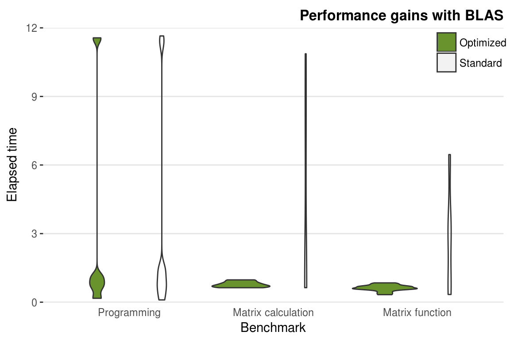

# Aceleración de Algoritmos de Álgebra Matricial en R

\justify

La multiplicación de matrices en `R` se maneja, en un nivel muy bajo, por la biblioteca que implementa las subrutinas de álgebra lineal básica (BLAS, por sus siglas en inglés). Cualquier versión de `R` que se descarga de CRAN viene con lo que se conoce como una _implementación de referencia_ de BLAS. Esta implementación ciertamente funciona, produce lo que todos concuerdan que son las respuestas correctas, pero de ninguna manera está optimizado. Utilizando ciertas operaciones que se consideran como _benchmarks_, lo siguiente es lo que tardamos en hacer operaciones matriciales en la versión no optimizada de `R`:

```{r Fig1, out.width='90%', echo=FALSE, fig.fullwidth = FALSE, fig.cap = "Benchmark de álgebra matricial versión no optimizada (comercial) de R. El total de 15 pruebas se realiza en un total de 7.16 segundos."}
knitr::include_graphics("01_figures/standard_R.jpeg")
```

Recientemente, sitios como _RBloggers_ sugieren que un gran beneficio de su versión (comercial) de `R` es que estaba vinculada a una mejor biblioteca de álgebra lineal. El resumen rápido es que realmente sólo hace una diferencia para pruebas de referencia (_benchmarks_) bastante artificiales. Para el trabajo "normal" de día a día es poco probable que se vea una diferencia la mayor parte del tiempo.

En la versión optimizada de `R`, el tiempo mejora de $7.16$ segundos a $6.89$ segundos:

```{r Fig2, out.width='90%', echo = FALSE, fig.fullwidth = FALSE, fig.cap = "Benchmark de álgebra matricial versión no optimizada (comercial) de R. El total de 15 pruebas se realiza en un total de 6.89 segundos."}
knitr::include_graphics("01_figures/optimized_R.jpeg")
```

Apple proporciona dos versiones de BLAS, la de referencia y una biblioteca BLAS optimizada (_vecLib_). La instalación de `R` para MacOS descargada de CRAN se envía con las bibliotecas vecLib y BLAS de referencia (la no optimizada se usa por defecto).

Para obtener los resultados de arriba, corrimos las pruebas primero para la versión no optimizada y después con la versión _vecLib_. Para cambiar a la versión optimizada, seguimos los pasos de [R: Use faster vecLib](https://gist.github.com/nicebread/6920c8287d7bffb03007)^[https://gist.github.com/nicebread/6920c8287d7bffb03007]. El código que se tiene que poner en la terminal es el siguiente:

```{r, eval=FALSE}
# Para cambiar a la libería optimizada vecLib
cd /Library/Frameworks/R.framework/Resources/lib
ln -sf  /System/Library/Frameworks/Accelerate.framework/
  Frameworks/vecLib.framework/Versions/Current/libBLAS.dylib libRblas.dylib

# Para regresar a la librería por defecto
cd /Library/Frameworks/R.framework/Resources/lib
ln -sf libRblas.0.dylib libRblas.dylib
```

Además, el `R script` para generar las pruebas se incluye en el archivo `script_blas.R`.


## OpenBLAS y Librería `benchmarkme`

Se encontró que la instalación de OpenBLAS llevó a una aceleración de 2 veces (de alrededor de 150 a 70 segundos). La mayoría de la ganancia de velocidad provino de las pruebas de álgebra matricial, como se puede ver en la siguiente figura. Hay que tener en cuenta que los resultados de dichas pruebas dependen en gran medida de las especificaciones de cada computadora. Sin embargo, muestra claramente que los puntos de referencia de "programación" (por ejemplo, el cálculo de los 3,500,000 números de Fibonacci) no son mucho más rápidos, mientras que los cálculos y las funciones de matrices reciben un aumento sustancial de la velocidad. Esto demuestra que la aceleración que se puede esperar de BLAS depende en gran medida del tipo de cálculos que se realicen.

```{r benchmark}
library(benchmarkme)
bench <- benchmarkme::benchmark_std()
```

```{r Fig3, out.width='100%', echo = FALSE, fig.fullwidth = TRUE, fig.cap= "Ganancias de rendimiento obtenidas al cambiar la biblioteca BLAS subyacente."}

```
