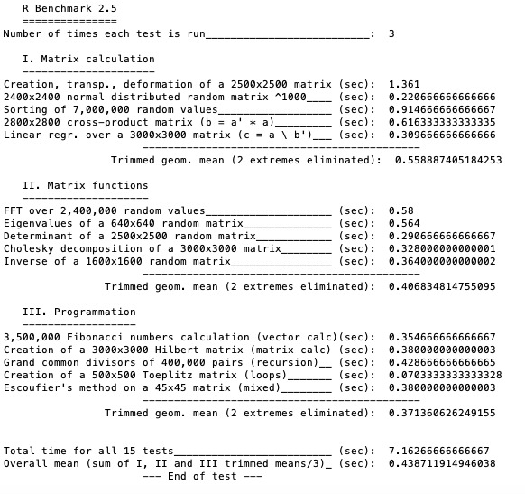
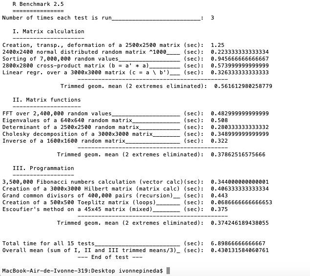

# Aceleración de Algoritmos de Álgebra Matricial en R

\justify
```{r setup}
library(tidyverse)
theme_set(theme_classic(base_size = 13))
options(
  ggplot2.continuous.colour = "viridis",
  ggplot2.continuous.fill = "viridis"
)
```


La multiplicación de matrices en `R` se maneja, en un nivel muy bajo, por la biblioteca que implementa las subrutinas de álgebra lineal básica (BLAS, por sus siglas en inglés). Cualquier versión de `R` que se descarga de CRAN viene con lo que se conoce como una _implementación de referencia_ de BLAS. Esta implementación ciertamente funciona, produce lo que todos concuerdan que son las respuestas correctas, pero de ninguna manera está optimizado. Utilizando ciertas operaciones que se consideran como _benchmarks_, lo siguiente es lo que tardamos en hacer operaciones matriciales en la versión no optimizada de `R`:

```{r Fig1, out.width='90%', echo=FALSE, fig.fullwidth = FALSE, fig.cap = "Benchmark de álgebra matricial versión no optimizada (comercial) de R. El total de 15 pruebas se realiza en un total de 7.16 segundos."}

```

Recientemente, sitios como _RBloggers_ sugieren que un gran beneficio de su versión (comercial) de `R` es que estaba vinculada a una mejor biblioteca de álgebra lineal. El resumen rápido es que realmente sólo hace una diferencia para pruebas de referencia (_benchmarks_) bastante artificiales. Para el trabajo "normal" de día a día es poco probable que se vea una diferencia la mayor parte del tiempo.

En la versión optimizada de `R`, el tiempo mejora de $7.16$ segundos a $6.89$ segundos:

```{r Fig2, out.width='90%', echo = FALSE, fig.fullwidth = FALSE, fig.cap = "Benchmark de álgebra matricial versión no optimizada (comercial) de R. El total de 15 pruebas se realiza en un total de 6.89 segundos."}

```

Apple proporciona dos versiones de BLAS, la de referencia y una biblioteca BLAS optimizada (_vecLib_). La instalación de `R` para MacOS descargada de CRAN se envía con las bibliotecas vecLib y BLAS de referencia (la no optimizada se usa por defecto).

Para obtener los resultados de arriba, corrimos las pruebas primero para la versión no optimizada y después con la versión _vecLib_. Para cambiar a la versión optimizada, seguimos los pasos de [R: Use faster vecLib](https://gist.github.com/nicebread/6920c8287d7bffb03007)^[https://gist.github.com/nicebread/6920c8287d7bffb03007]. El código que se tiene que poner en la terminal es el siguiente:

```{r, eval=FALSE}
# Para cambiar a la libería optimizada vecLib
cd /Library/Frameworks/R.framework/Resources/lib
ln -sf  /System/Library/Frameworks/Accelerate.framework/
  Frameworks/vecLib.framework/Versions/Current/libBLAS.dylib libRblas.dylib

# Para regresar a la librería por defecto
cd /Library/Frameworks/R.framework/Resources/lib
ln -sf libRblas.0.dylib libRblas.dylib
```

Además, el `R script` para generar las pruebas se incluye en el archivo `script_blas.R`.


## OpenBLAS y Medición de la Aceleración de Cómputo

Por último, el `R script` para generar las pruebas antes mencionado se utilizó dos veces: la primera vez antes de instalar OpenBlas en la computadora y la segunda vez después de instalarlo. OpenBlas se instaló mediante el comando: `sudo apt-get install libopenblas-dev`. Nuestro `R script` crea un archivo `script_blas.csv` que contiene los tiempos de cada operación algebraica:
```{r}
times <- as_tibble(read_csv(file = "02_files/script_blas.csv"))
times
```

```{r}
time_dif <- times %>% 
  mutate(diff = BLAS - no_BLAS)
column_names <- c("Prueba", "BLAS", "no_BLAS", "acc_sec")
colnames(time_dif) <- column_names
time_dif
```

Se encontró que la instalación de OpenBLAS llevó a una aceleración de 28 segundos (en total) para todas las pruebas, y la prueba con mayor aceleración resultó ser la de encontrar el eigenvector de una matriz de dimensiones $(2,500 \times 2,500)$. Podemos visualizar la diferencia en segundos para cada prueba:


```{r, eval = FALSE}
# Ordenamos de mayor a menos, por aceleración:
time_dif$Prueba <-  factor(time_dif$Prueba,
                           levels = time_dif$Prueba[order(-time_dif$acc_sec)])

# Graficamos:
time_dif %>% ggplot(mapping = aes(fill = acc_sec, x = Prueba)) +
  geom_col(mapping = aes(y = -acc_sec)) +
  coord_flip() + labs (x = "Aceleración en segundos")
```

```{r, out.width='100%', echo = FALSE, fig.fullwidth = TRUE, fig.cap = "Aceleración (en segundos) por operación matricial."}
knitr::include_graphics("01_figures/plot_acceleration")
```

